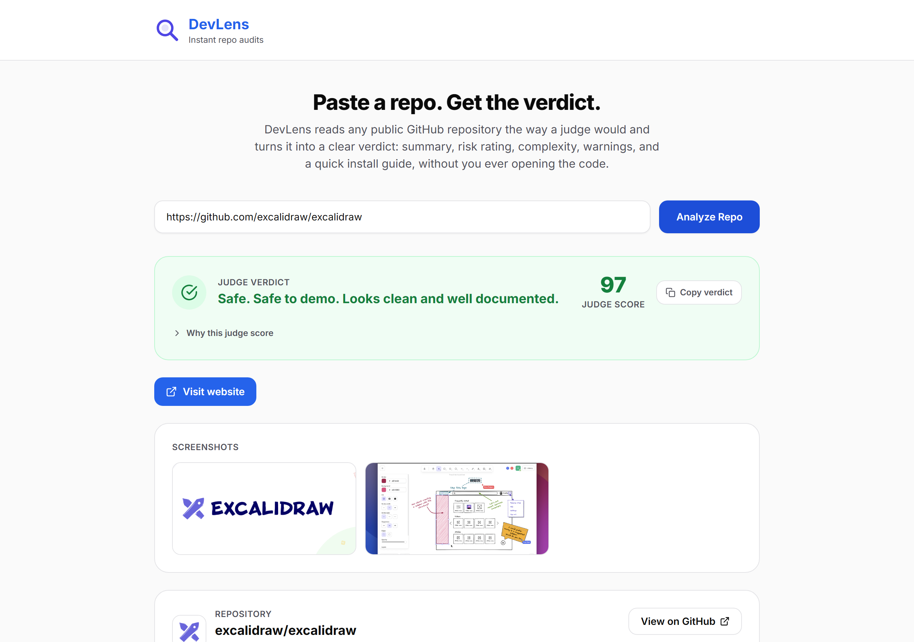

# DevLens

**Instant audits for any GitHub repository.**

DevLens takes a single GitHub repo link and turns it into a clean, one-page dashboard: a
2-sentence summary of what the project actually does, a complexity score, a risk rating
(Safe / Moderate / Warning), the key setup warnings, and a copy-pasteable install guide,
all generated in seconds by AI.



---

## Inspiration

Hackathon judges see dozens of repos in a single afternoon. Most of that time is spent
just figuring out what a project even does and whether it actually runs, before any real
judging can happen. We built DevLens to compress that discovery phase from minutes to
seconds, so judges can spend their limited time evaluating ideas instead of untangling
READMEs and `requirements.txt` files.

## What it does

1. **Paste a GitHub URL.** Any public repository.
2. **DevLens reads the repo.** It pulls metadata, file tree, README, languages,
   contributors, license, and dependency count straight from the GitHub API, no cloning
   required.
3. **AI forms a verdict.** That signal is handed to an LLM which returns a structured
   verdict: summary, complexity score, risk level, tech stack, highlights, warnings, and
   install steps.
4. **Judge-friendly dashboard.** The frontend renders it all as clean, color-coded cards,
   readable in under 10 seconds, with a direct link back to the source repository.

### Dashboard includes
- **Judge score (0 to 100)**, computed deterministically in code (not by the AI) from
  license, tests, CI, Docker, a live demo link, recent activity, and warning severity, so
  every repo is scored the same way and judges get one comparable number.
- **Judge verdict banner** stating the risk rating up front, with a Copy verdict button
  that copies a plain-text summary for a scoring sheet.
- **Demo and video buttons**, deterministically extracted from the README (Vercel,
  Netlify, GitHub Pages, YouTube, Loom, etc.) and surfaced above the fold, because "can I
  see it running" is usually a judge's first question.
- **Project summary**, exactly two sentences, no fluff.
- **Complexity score**, a 1 to 10 gauge that shifts from green to red as complexity rises,
  with an expandable panel showing the 5 factors (codebase size, dependencies,
  architecture, tech stack diversity, setup effort) behind the number.
- **Repo stats**: stars, forks, open issues, contributors, license, repo age, last commit
  activity, and dependency count.
- **A real security scan**, not just an AI guess: flags a committed `.env` at the repo
  root, common secret key patterns in entry files, and environment variables used in code
  but undocumented in `.env.example`. These are labeled "Verified" in the UI to
  distinguish them from the AI's own warnings.
- **Highlights and warnings**, positive signals and risk signals shown side by side, each
  warning tagged with a severity (high, medium, low) so real blockers stand out.
- **Quick install guide**, an interactive numbered stepper with a copy button per step.
- **Compare repositories**, a collapsible section to shortlist a few repos and see their
  judge scores, risk, and top warning side by side.

## Architecture

DevLens is intentionally a lightweight monolith, built to be fast to ship and easy to
demo within a hackathon's time constraints.

```
Browser (Tailwind + vanilla JS)
        |  fetch("/api/analyze")
        v
FastAPI backend (app/main.py)
        |  1. Parse the GitHub URL
        |  2. Pull metadata, file tree, README, languages, contributors, license,
        |     dependency count via the GitHub REST API
        |  3. Send that signal to an LLM with a strict JSON schema prompt
        v
Google Gemini (generateContent API)
        |  returns structured JSON verdict
        v
Dashboard renders the verdict as cards and badges
```

**Stack:**
- **Backend:** FastAPI (serves both the JSON API and the static frontend)
- **Frontend:** Single `index.html` with Tailwind CSS (CDN) and vanilla JavaScript, no
  build step, no framework overhead
- **AI:** Google Gemini (`gemini-2.5-flash`) for the final verdict generation, satisfying
  the hackathon's official AI requirement. Groq was used during development for fast,
  free iteration on the prompt and error handling before the final swap to Gemini.
- **Data source:** GitHub REST API (public, no cloning, no auth required for public repos)

## Gemini API integration

Gemini is the mandatory AI provider for the final submission (Groq is only a
free/fast stand-in used during development, see the note below). Everything
Gemini-related lives in [`app/main.py`](app/main.py):

- **Where it's called:** `call_gemini(signal)` sends the repo signal built by
  `fetch_repo_signal()` (metadata, activity, license, languages, dependency
  count, security-scan findings, README excerpt) to Google's standard
  generative language endpoint:
  `POST https://generativelanguage.googleapis.com/v1beta/models/gemini-2.5-flash:generateContent`
- **How the verdict is structured:** the same `SYSTEM_PROMPT` used for both
  providers is passed as Gemini's `systemInstruction`, and
  `generationConfig.responseMimeType` is set to `application/json` so Gemini
  returns a clean JSON object matching DevLens's schema (summary,
  complexity_score, complexity_factors, risk_level, tech_stack, highlights,
  warnings, prerequisites, install_steps) with no markdown fences to strip.
- **Switching providers:** the `AI_PROVIDER` environment variable is the only
  thing that decides which provider runs; `call_ai()` dispatches to
  `call_gemini()` when `AI_PROVIDER=gemini` and to `call_groq()` otherwise.
  No other code path changes between providers, so the app's behavior and
  output schema are identical regardless of which one is active.
- **Where the key comes from:** `GEMINI_API_KEY` is read from the environment
  via `python-dotenv` in `load_dotenv()` and is never hardcoded, logged, or
  exposed to the browser (see [Security](#security)).

## Running locally

### Prerequisites
- Python 3.10+
- A [Google Gemini API key](https://aistudio.google.com/apikey) (free tier works)

### Setup

```bash
git clone https://github.com/Josequevedov08/DevLens.git
cd DevLens
pip install -r requirements.txt
```

Copy the example environment file and fill in your key:

```bash
cp .env.example .env
```

```env
AI_PROVIDER=gemini
GEMINI_API_KEY=your_key_here
GITHUB_TOKEN=required_in_practice_see_note_below
```

> **About `GITHUB_TOKEN`:** DevLens pulls a lot of signal per analysis (metadata, file
> tree, README, languages, contributors, license, dependency file, plus a small security
> scan of a couple of entry files), which adds up to roughly 8 to 10 GitHub API calls per
> repo. Unauthenticated requests are capped at 60 per hour, so a demo can exhaust that in
> 6 to 8 analyses. A free
> [personal access token](https://github.com/settings/tokens) (classic, no scopes needed
> for public repos) raises that to 5,000 per hour, so treat it as required rather than
> optional before demoing.

Run the server:

```bash
uvicorn app.main:app --reload
```

Open **http://localhost:8000** and paste in any public GitHub repo URL.

> Want to iterate faster during development? Set `AI_PROVIDER=groq` and add a
> [`GROQ_API_KEY`](https://console.groq.com/keys) instead, same code path, same JSON
> schema, just a faster and free provider for local testing. Flip it back to `gemini`
> before submitting.

## Security

- API keys are never hardcoded and are loaded exclusively via `python-dotenv` from a
  local `.env` file (excluded from version control via `.gitignore`). See
  `.env.example` for the full list of required variables.
- Errors returned to the client never leak upstream provider responses or keys.
- `/api/analyze` is rate-limited per IP (in-memory, 10 requests per minute) to protect
  against runaway AI-key spend.
- Security response headers (`X-Content-Type-Options`, `X-Frame-Options`,
  `Referrer-Policy`, `Permissions-Policy`) are set on every response.
- DevLens does not use cookies, accounts, or any persistent storage. See the in-app
  [Privacy Policy](app/static/privacy.html), [Terms of Service](app/static/terms.html),
  and [Cookie Policy](app/static/cookies.html), also linked in the app's footer.

## What's next

- Cache repeated analyses to cut down on API calls
- Support private repos via OAuth
- Add a shareable or exportable judge report (PDF or link)
- Score trends across multiple submissions for the same team

## License

MIT

## Changelog

### v1, Initial MVP
- FastAPI backend and a Groq/Gemini-switchable AI layer (`AI_PROVIDER` env var).
- Single-page Tailwind dashboard: summary, complexity bar, warnings list, install guide.
- `.env` / `.env.example`, `.gitignore`, Devpost-ready README.

### v2, Judge dashboard revamp
- Complexity gauge now color-codes green to amber to red by score instead of a flat bar.
- Warnings carry a severity (high, medium, low) and render as bordered, colored alert
  rows instead of a flat list, plus a separate highlights panel for positive signals.
- Install guide became an interactive numbered stepper with a per-step copy button.
- Signal pulled from GitHub expanded significantly: license, stars, forks, open issues,
  contributors count, top languages, dependency count, last-commit recency, and a direct
  link back to the repository.
- Added `/privacy`, `/terms`, `/cookies` pages linked from the footer.
- Added basic hardening: per-IP rate limiting on `/api/analyze` and security response
  headers.

### v3, Visual and content pass
- Full visual redesign to a clean, light, professional look inspired by the Arka design
  system: Inter typeface, soft-bordered white cards, a single blue accent color, and
  hand-drawn line icons in place of emoji throughout the app.
- Removed every emoji and em dash from the UI, README, and legal pages for a more
  professional tone.
- Added an explicit "Back to DevLens" link on every legal page.
- Added a "How this score is calculated" panel under the complexity gauge, listing the
  5 factors (codebase size, dependencies, architecture, tech stack diversity, setup
  effort) the AI is now required to justify with a per-repo note.
- Fixed the install guide's code blocks, which used a black terminal look that clashed
  with the rest of the light UI, to match the page's card style.
- Dropped "judge-friendly" from the tagline.

### v4, Judge-first features
- Added a deterministic Judge Score (0 to 100), computed in code from license, tests,
  CI, Docker, demo link, activity, and warning severity, so judges get one comparable
  number instead of five separate signals.
- Added deterministic README parsing for a live demo link and/or a video link
  (YouTube/Loom), surfaced as prominent buttons above the fold.
- Added a real, code-level security scan (regex-based, not AI-guessed): a committed
  root-level `.env` file, common secret key patterns in a couple of entry files, and env
  vars used in code but undocumented in `.env.example`. Findings are labeled "Verified"
  in the UI. Fixed a false positive where a nested test-fixture `.env` (for example
  Flask's `tests/test_apps/.env`) was scored as a critical leak; only a root `.env` is
  now high severity, nested ones are a low-severity note.
- Added a Repo age stat (from `created_at`) so judges can spot repos that predate a
  hackathon's start.
- Added a Copy verdict button that copies a plain-text summary for a scoring sheet.
- Added a collapsible Compare repositories section for shortlisting finalists side by
  side.
- `GITHUB_TOKEN` moved from "recommended" to effectively required: the added security
  scan brings each analysis to roughly 8 to 10 GitHub API calls.

### v5, Judge score transparency and smarter detection
- Added a `judge_score_breakdown` returned by the API and rendered as an expandable
  list (both on the main dashboard and in each Compare card) so it's clear exactly why
  one repo outscored another instead of the number being a black box.
- The demo/website link now prefers GitHub's own structured `homepage` field over
  anything scraped from the README, since it's an authoritative, author-set value.
- Fixed a demo-link false positive where README badges (funding badges, coverage
  badges, solidarity banners) hosted on domains like `github.io` were being read as the
  project's own live demo. `github.io` links are now only accepted when they belong to
  the repo owner's own subdomain, plus a denylist for known non-demo badge domains.
- The demo video, when found, is embedded and playable inline instead of only linking
  out to it.
- Fixed a horizontal page-overflow bug where a long warning/highlight/factor string
  (e.g. a deeply nested file path) pushed the page wider than the viewport instead of
  wrapping.

### v6, Screenshot gallery, prerequisites, and comparison UX
- Added a Screenshots gallery, deterministically extracted from README images
  (markdown and HTML `` tags), filtered against a badge/funding-service denylist
  and SVGs (logos/badges) so it stays real project screenshots.
- Added a Prerequisites chip row above the install guide (e.g. "Node.js >=18",
  "Python 3.11+", "Docker", "Git"), using the exact Node engines version from
  `package.json` when present instead of guessing.
- Fixed Compare card misalignment so every card's "Why this score?" toggle and GitHub
  link line up at the same height regardless of how much warning text each one has.
- Compare now auto-seeds the repo already open on the main dashboard the first time
  another repo is added to the comparison, plus duplicate-repo prevention and a
  Clear all button.

### v7, Mobile responsiveness and submission readiness
- Verified and fixed mobile layout end to end: install-guide code blocks now wrap
  instead of requiring horizontal scroll inside a tiny box, confirmed no element causes
  horizontal page overflow at 375px width.
- Added a dedicated Gemini API integration section to this README.
